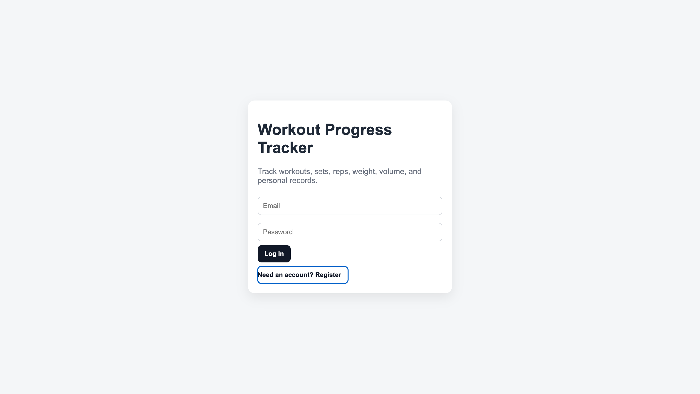
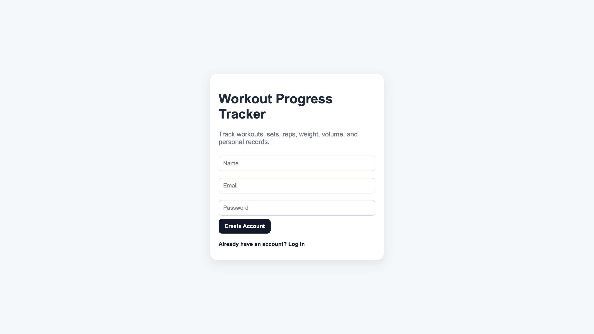
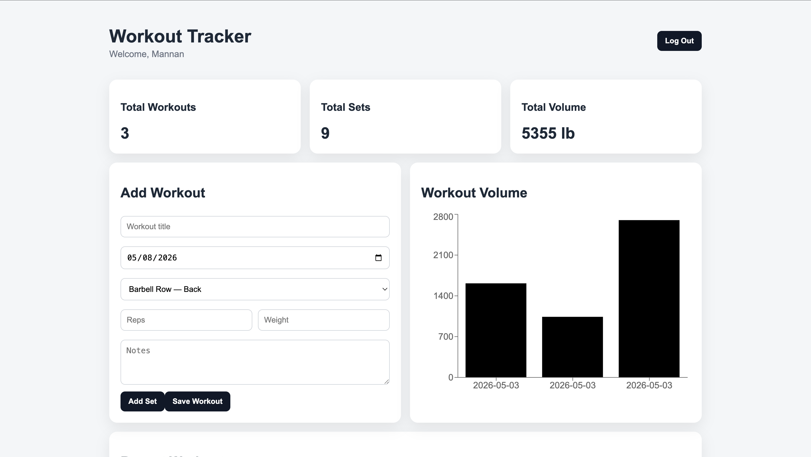
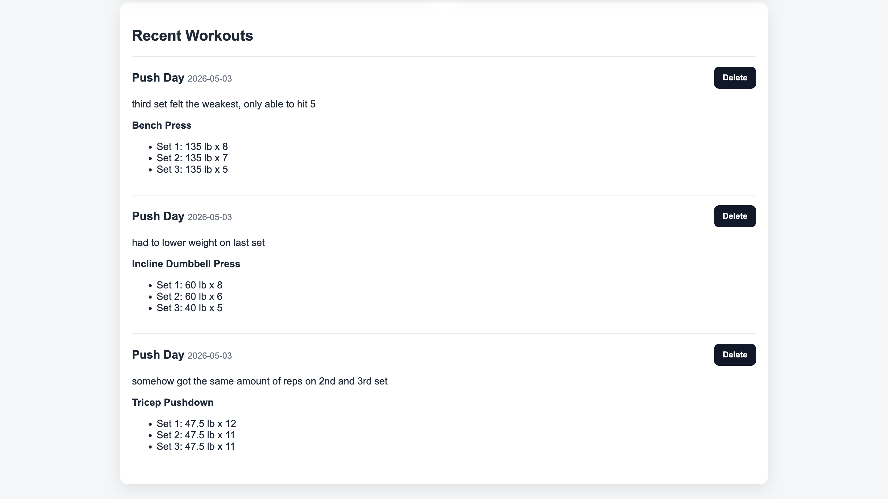

# Workout Progress Tracker

A full-stack fitness tracking web application built with React, Flask, and SQLAlchemy that allows users to log workouts, track progress, monitor workout volume, and manage exercise history through a modern responsive dashboard.

## Live Demo

Frontend: YOUR_VERCEL_URL_HERE

Backend API: YOUR_RENDER_URL_HERE

> Note: The backend is hosted on Render free tier and may take a few seconds to wake up after inactivity.

---

# Features

- User authentication (register/login)
- Secure JWT-based authentication
- Workout tracking
- Exercise logging
- Set/reps/weight tracking
- Workout history dashboard
- Workout volume analytics
- Dynamic progress charts
- Responsive modern UI
- Workout templates (Push/Pull/Legs)
- Delete workouts
- Notes for workouts

---

# Screenshots

## Login Screen



---

## Create Account Screen



---

## Dashboard / Home Screen



---

## Recent Workouts



---

# Technologies Used

## Frontend
- React
- Vite
- Recharts
- CSS3

## Backend
- Flask
- Flask-JWT-Extended
- Flask-SQLAlchemy
- Flask-Bcrypt
- Flask-CORS

## Database
- SQLite

## Deployment
- Vercel
- Render

---

# Project Structure

```text
gym-workout-tracker/
├── backend/
├── frontend/
├── screenshots/
├── README.md
```

---

# Running Locally

## Clone Repository

```bash
git clone https://github.com/mzahid23/gym-workout-tracker.git
cd gym-workout-tracker
```

---

## Backend Setup

```bash
cd backend
pip install -r requirements.txt
gunicorn "app:create_app()"
```

---

## Frontend Setup

```bash
cd frontend
npm install
npm run dev
```

---

# Environment Variables

Frontend `.env`:

```env
VITE_API_URL=YOUR_BACKEND_URL
```

---

# Concepts Learned

This project strengthened understanding of:

- Full-stack web development
- REST API integration
- Authentication systems
- Database management
- Frontend/backend communication
- Deployment workflows
- Responsive UI design
- State management in React

---

# Future Improvements

- Exercise search/filtering
- Personal records tracking
- Dark mode
- Bodyweight tracking
- Nutrition tracking
- Calendar workout history
- Social/community features
- PostgreSQL production database

---

# Author

Muhammad Zahid
